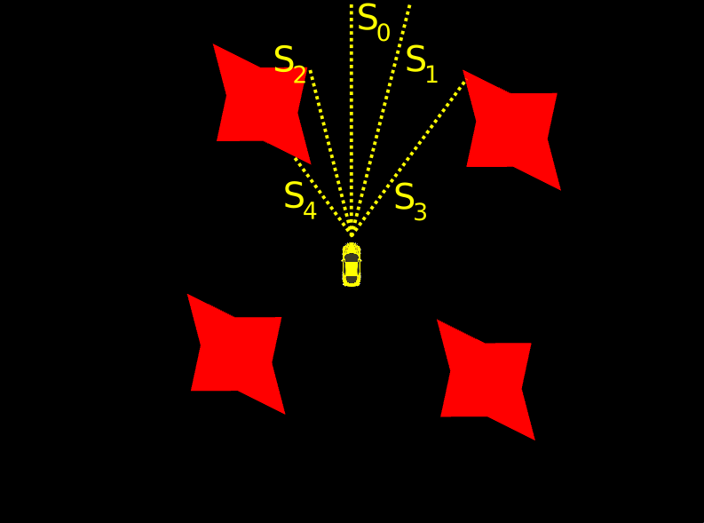

# Smart Car
This project renders a simple, dynamic 2D-map, and a car using OpenGL. The car will be controlled by an agent which task is to survive without crashing for as long as possible. The car is equipped with 5 range-finding sensors measuring the straight distance to the next obstacle (see picture below). The agent will learn a function that maps these sensor measurements to an action, it's called the action-map. The possible actions therefore are turn-left (`0`), turn-right (`2`), and no-turn (`0`). The car will automatically move forward and cannot brake or accelerate. The action-map will be learned with [Q-Learning](https://en.wikipedia.org/wiki/Q-learning), where, instead of a Q-Table, a Q-Function will be approximated by an Artificial Neural Network. The agent implements an [epsilon-greedy](https://en.wikipedia.org/wiki/Multi-armed_bandit#Approximate_solutions) strategy for choosing an action. 


# Installation on Ubuntu
## Prerequisites
```bash
sudo apt-get update
sudo apt-get install libglu1-mesa-dev mesa-common-dev # OpenGL
sudo apt-get install libglew-dev                      # GLEW
sudo apt-get install freeglut3-dev                    # GLUT
sudo apt-get install libglm-dev                       # GLM
```

## Build Thirdparty Libraries from Source
### Build Simple-OpenGL-Image-Library (SOIL)
the [SOIL library](https://github.com/kbranigan/Simple-OpenGL-Image-Library) is used for loading PNG/JPEG images with OpenGL
```bash
cd <PROJECT_BASE>/thirdparty
git clone https://github.com/kbranigan/Simple-OpenGL-Image-Library.git
cd Simple-OpenGL-Image-Library
mkdir build
cd build
cmake ..
make # no 'make install' required
```

### Build FANN
the [FANN library](https://github.com/libfann/fann) is used for the ANN implementation and training
```bash
cd <PROJECT_BASE>/thirdparty
git clone https://github.com/libfann/fann.git
cd fann
cmake .
make # no 'make install' required
```

## Build Project
```bash
cd <PROJECT_BASE>
mkdir build
cd build
cmake ..
make
```

# Usage
* run code: `./smart-car`
  * run the code from inside the `<PROJECT_BASE>/build` directory, else some relative paths to the shader code will not be resolved correctly. If called from outside `<PROJECT_BASE>/build` adjust the relative paths in file ``src/Managers/Shader_Manager.cpp` accordingly or set them absolute.
* press `1` to control the car with the keyborad using `w`, `a`, `s`, `d` keys
* press `2` to give back control to the agent (default at start)
* press `ESC` to exit

# TODOs
* the agents parameters still need to be tuned for better results
* use C++ backends of TensorFlow or PyTorch for ANN implementation and training. The project was originally written in 2014, before TensorFlow or PyTorch were around. Therefore today FANN doesn't seem to be the best choice anymore.
